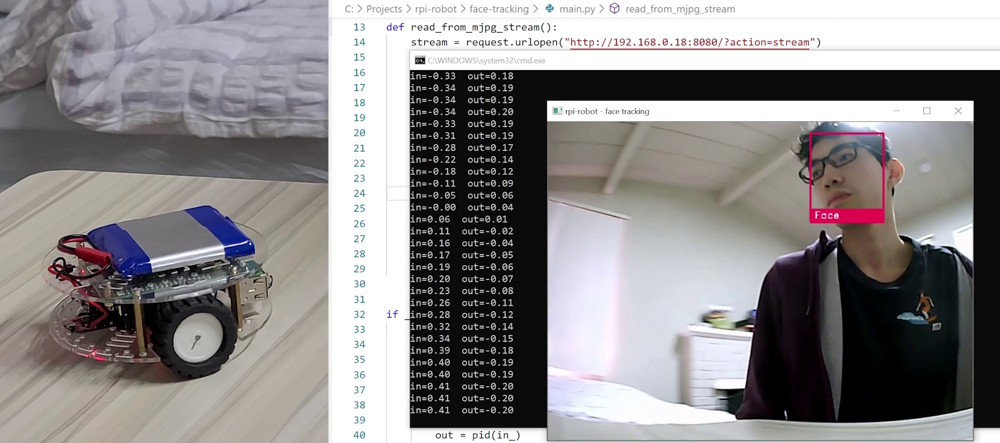

_rpi-robot_ is my personal project of a raspberry pi robot built for fun!



**Features**:

- Remote control over browser (phone or desktop computer).
- Track the face in the camera and rotate the robot towards it.

## Usage

Please run `install.sh` to install all the necessary tools and libraries for this project.

```
bash install.sh
```

Run the following command to start the robot.

```
bash rpi-robot.sh
```

Goto `http://<ip addr of your rpi>:5000` in your browser for remote control.

## License

Distributed under the MIT License. See `LICENSE` for more information.
